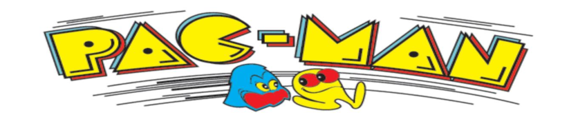
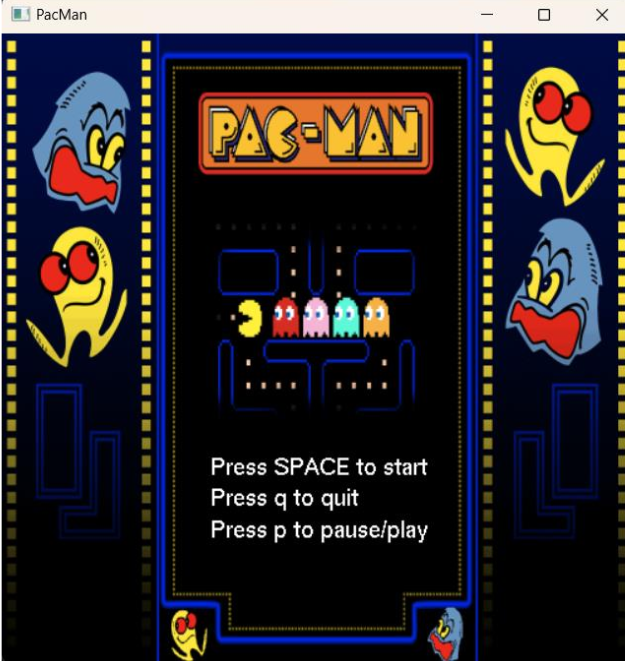
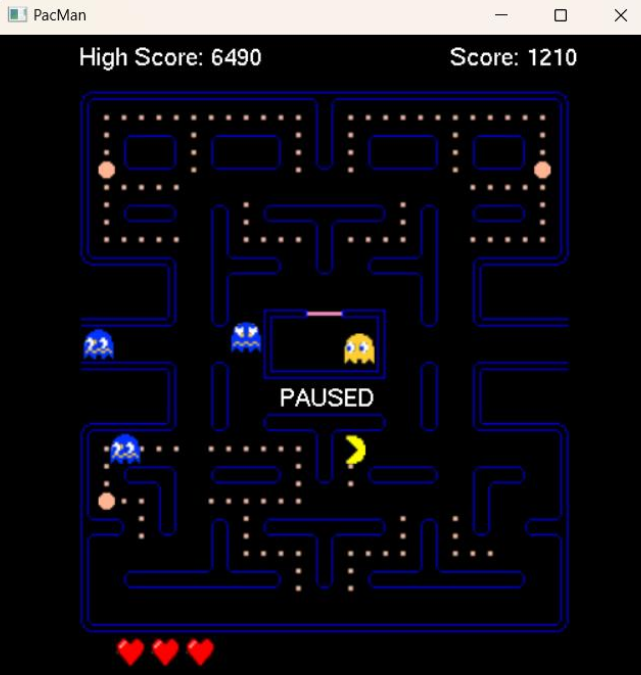
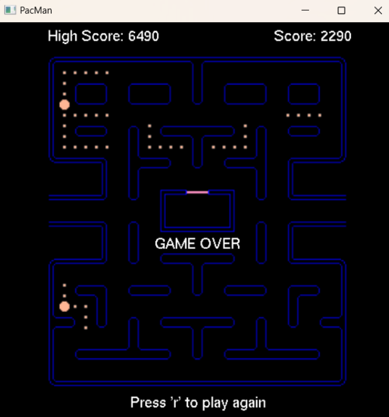

# Pacman Game



## Introduction

Welcome to the Pacman game developed using OpenGL and C++! This classic arcade game brings back nostalgic memories while offering a modern twist with enhanced graphics and smooth gameplay. Navigate Pacman through mazes, gobble up dots, and avoid the ghosts to achieve the highest score!

## Features

- Classic Pacman gameplay with modern graphics.
- Smooth controls for seamless navigation.
- Multiple levels of increasing difficulty.
- Power-ups and bonus items to enhance gameplay.
- High score tracking to challenge yourself and friends.

## Installation

To play the Pacman game, follow these steps:

1. Clone the repository to your local machine:

```bash
git clone https://github.com/username/pacman-game.git
```

2. Open Visual Studio 2022.

3. Select "Open a project or solution" from the start window.

4. Navigate to the directory where you cloned or downloaded the Pacman game repository and open the solution file (e.g., `pacman.sln`).

5. Once the solution is opened, locate the main file of the program, which is `pacman.cpp`.

6. Ensure that you have OpenGL libraries properly configured in your Visual Studio project. If not, you may need to add them by configuring the project properties.

7. Build the solution by pressing `Ctrl+Shift+B` or selecting "Build" from the menu.

8. After successfully building the solution, you can run the game by pressing `Ctrl+F5` or selecting "Start Without Debugging" from the menu.

## How To Play
The aim of Pac-Man is to eat as many pills as possible, without being caught by the ghosts.

If Pac-Man eats a super pill the ghosts will turn frightened and Pac-Man will be able to eat them to gain bonus points. Otherwise, if Pac-Man encounters a ghost he will lose a life.

Beat high scores, and challenge yourself to reach the top of the leaderboard!!

## Controls
### Movement
Use the arrow keys to control Pacman's movement:
  - Up Arrow: ```↑```
  - Down Arrow: ```↓```
  - Left Arrow: ```←```
  - Right Arrow: ```→```

### Game Controls
- ```space```: To start the game.
- ```P```: To Pause/Play the game.
- ```Q```: To Quit the game.
- ```R```: To Reset the game.


## Screenshots

Here are some screenshots from the Pacman game:

### Start Page


### Mid-Game 


### Chasing Ghosts


### Game Over



## Credits

This Pacman game was developed by Siddharth Maithani with contributions from [Kashvi Jain](https://github.com/Kashvi1234) and Tanisha Maheshwary. 
Special thanks to the OpenGL and C++ communities for their invaluable resources and support.


## License

This project is licensed under the MIT License. See the [LICENSE](LICENSE) file for details.

## Report

For a detailed report on the development process and technical aspects of the Pacman game, please refer to [Report.pdf](PacmanReport.pdf).

